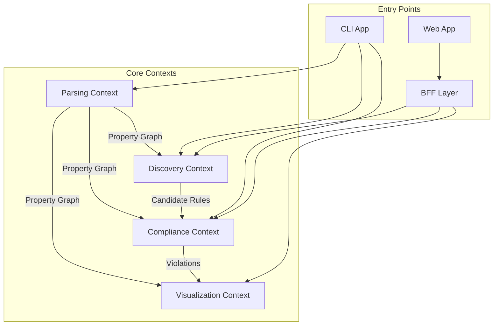

# Bounded Context Refinement Analysis

## Question 1: Should Rules, Evaluation, and Remediation be One Context?

### Current Proposal (Separate Contexts)
- **Rules Context**: Manages rule definitions, ADRs, conditions
- **Evaluation Context**: Executes rules against codebase
- **Remediation Context**: Fixes violations

### Analysis

#### Arguments FOR Combining Them

1. **High Cohesion**
   - Rules define WHAT to check
   - Evaluation executes HOW to check
   - Remediation determines HOW to fix
   - These are tightly coupled - a rule change affects evaluation and remediation

2. **Data Flow Dependencies**
   ```
   Rule Definition → Evaluation → Violation → Remediation
   ```
   - This is a natural pipeline within a single domain
   - Violations don't make sense without rules
   - Fixes are specific to rule types

3. **Shared Domain Language**
   - Terms like "violation", "compliance", "condition" span all three
   - Rule types determine evaluator types and fix strategies
   - Single ubiquitous language suggests single context

4. **Atomic Changes**
   - Adding a new rule type requires:
     - Rule definition
     - Evaluator implementation
     - Fix strategy
   - These changes should be cohesive

5. **Reduced Complexity**
   - Fewer inter-context boundaries
   - Simpler dependency graph
   - Easier to reason about

#### Arguments AGAINST Combining Them

1. **Different Rates of Change**
   - Rules change frequently (user configuration)
   - Evaluators are more stable (implementation)
   - Remediation strategies evolve independently

2. **Different Technical Concerns**
   - Rules: Configuration, persistence, versioning
   - Evaluation: Performance, traversal algorithms
   - Remediation: Code generation, AST manipulation

3. **Potential Size**
   - Combined context could become too large
   - Harder to maintain and test
   - Violates single responsibility at context level

### **Recommendation: COMBINE THEM**

I recommend combining these into a single **"Compliance" Context** because:

1. They share the same core domain concept: ensuring code meets standards
2. The coupling between them is inherent, not accidental
3. The plugin pattern can handle extensibility within the context
4. It simplifies the mental model significantly

### Proposed Structure for Combined Context

```
contexts/compliance/
├── domain/
│   ├── entities/
│   │   ├── Rule.ts
│   │   ├── Violation.ts
│   │   └── Fix.ts
│   ├── services/
│   │   ├── RuleEngine.ts
│   │   ├── Evaluator.ts
│   │   └── Remediator.ts
│   └── ports/
│       ├── RuleRepository.ts
│       ├── EvaluatorPlugin.ts
│       └── FixStrategy.ts
├── application/
│   ├── usecases/
│   │   ├── EvaluateCodebase.ts
│   │   ├── ApplyFixes.ts
│   │   └── ManageRules.ts
│   └── dto/
│       └── ComplianceReport.ts
└── infrastructure/
    ├── evaluators/     # Plugin implementations
    ├── fixers/         # Fix strategies
    └── persistence/    # Rule storage
```

## Question 2: Discovery Functionality Placement

### What is Discovery?
The LLM-powered agent that:
- Crawls codebases
- Analyzes existing patterns
- Infers implicit standards
- Generates candidate rules
- Learns from documentation, configs, existing code

### Current Plan Gap
You're absolutely right - this critical functionality isn't properly addressed in the current design!

### Analysis of Placement Options

#### Option 1: Part of Compliance Context
**Pros:**
- Generates rules, so closely related to rule management
- Can reuse rule validation logic

**Cons:**
- Discovery is about learning/inference, not enforcement
- Different computational patterns (LLM vs deterministic)
- Would overload the Compliance context

#### Option 2: Separate Discovery Context
**Pros:**
- Clear separation of concerns
- Can evolve independently
- Different tech stack needs (LLM integration)
- Different performance characteristics

**Cons:**
- Another context to maintain
- Need to define clear boundaries

#### Option 3: Part of Parsing Context
**Pros:**
- Discovery needs to analyze the codebase structure
- Could share parsing infrastructure

**Cons:**
- Parsing is about structure, discovery is about semantics
- Very different responsibilities

### **Recommendation: SEPARATE DISCOVERY CONTEXT**

Discovery deserves its own bounded context because:

1. **Unique Domain**: Pattern recognition and inference vs rule enforcement
2. **Different Actors**: Uses LLMs and heuristics vs deterministic evaluation
3. **Different Lifecycle**: Runs occasionally vs continuously
4. **Complex Logic**: Needs sophisticated analysis capabilities

### Proposed Discovery Context Structure

```
contexts/discovery/
├── domain/
│   ├── entities/
│   │   ├── Pattern.ts          # Detected patterns
│   │   ├── CandidateRule.ts    # Proposed rules
│   │   └── Evidence.ts         # Supporting evidence
│   ├── services/
│   │   ├── PatternDetector.ts
│   │   ├── RuleInferencer.ts
│   │   └── ConfidenceScorer.ts
│   └── ports/
│       ├── LLMProvider.ts
│       └── AnalysisStrategy.ts
├── application/
│   ├── usecases/
│   │   ├── DiscoverPatterns.ts
│   │   ├── GenerateCandidateRules.ts
│   │   └── AnalyzeDocumentation.ts
│   └── dto/
│       └── DiscoveryReport.ts
└── infrastructure/
    ├── llm/            # LLM integrations
    ├── analyzers/      # Pattern detection strategies
    └── heuristics/     # Rule inference logic
```

## Revised Bounded Context Map



## Updated Context Responsibilities

### 1. **Parsing Context**
- Transform code into property graphs
- Support multiple parser types
- Provide unified representation

### 2. **Compliance Context** (formerly Rules + Evaluation + Remediation)
- Define and manage rules
- Evaluate codebase against rules
- Generate and apply fixes
- Manage whitelists and exceptions

### 3. **Visualization Context**
- Project data into views
- Support multiple visualization types
- Export capabilities

### 4. **Discovery Context** (NEW)
- Analyze codebase patterns
- Infer implicit standards
- Generate candidate rules
- Learn from existing configuration
- Provide confidence scores

## Benefits of This Structure

1. **Clear Responsibilities**: Each context has a focused domain
2. **Loose Coupling**: Contexts communicate through well-defined interfaces
3. **Independent Evolution**: Each can be developed/deployed separately
4. **Optimal Team Organization**: Teams can own specific contexts
5. **Technology Flexibility**: Each context can use appropriate tech

## Migration Path from Original Design

1. **Immediate**: Combine Rules/Evaluation/Remediation → Compliance
2. **Next**: Add Discovery as new context
3. **Minimal Changes**: Parsing and Visualization remain as designed
4. **Interface Stability**: Use events/DTOs between contexts

## Key Interfaces Between Contexts

```typescript
// Parsing → Compliance
interface PropertyGraph {
  nodes: Node[];
  edges: Edge[];
  metadata: GraphMetadata;
}

// Discovery → Compliance
interface CandidateRule {
  id: string;
  type: RuleType;
  condition: Condition;
  confidence: number;
  evidence: Evidence[];
  suggestedPriority: Priority;
}

// Compliance → Visualization
interface ComplianceReport {
  violations: Violation[];
  coverage: CoverageStats;
  trends: TrendData;
}

// Discovery → User (via BFF)
interface DiscoveryReport {
  candidateRules: CandidateRule[];
  patterns: Pattern[];
  recommendations: Recommendation[];
}
```

## Conclusion

The revised architecture with:
- **4 bounded contexts** (Parsing, Compliance, Visualization, Discovery)
- **Combined Compliance context** for rules/evaluation/remediation
- **Separate Discovery context** for AI-powered pattern detection

This provides better cohesion, clearer boundaries, and properly accounts for the discovery functionality that's critical to the system's value proposition.

The key insight is that **Compliance is about enforcement** while **Discovery is about learning** - these are fundamentally different concerns that deserve separate contexts.